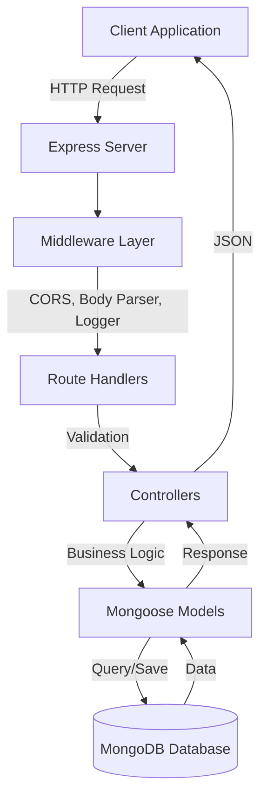
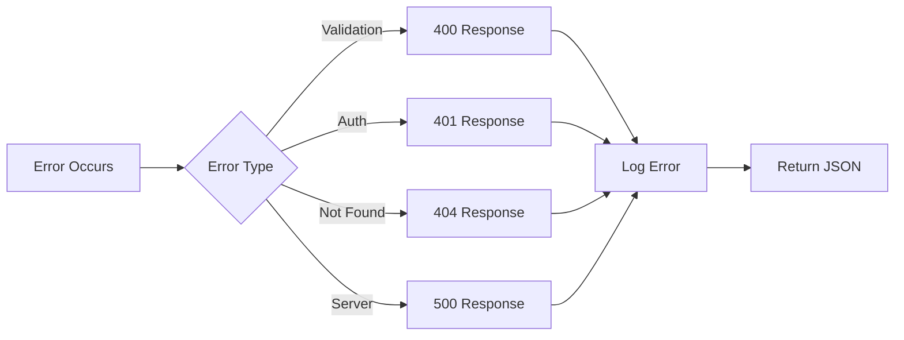

# Express Project Design Document

## Overview

This design document outlines the architecture and implementation approach for a production-ready Express.js application with MongoDB integration, JWT authentication, request validation, and Vercel deployment support. The application follows a modular MVC-inspired architecture with clear separation of concerns.

## Architecture

### High-Level Architecture



### Project Structure

```
express-project/
├── src/
│   ├── config/
│   │   └── database.js          # MongoDB connection configuration
│   ├── controllers/
│   │   └── authController.js    # Authentication business logic
│   ├── middleware/
│   │   ├── auth.js              # JWT verification middleware
│   │   ├── errorHandler.js      # Global error handling
│   │   ├── logger.js            # Request logging
│   │   └── validate.js          # Joi validation middleware
│   ├── models/
│   │   └── User.js              # User Mongoose schema
│   ├── routes/
│   │   ├── index.js             # Main router aggregator
│   │   └── authRoutes.js        # Authentication routes
│   ├── utils/
│   │   └── tokenUtils.js        # JWT helper functions
│   ├── validators/
│   │   └── authValidator.js     # Joi schemas for auth
│   ├── app.js                   # Express app configuration
│   └── server.js                # Server entry point
├── .env.example                 # Environment variables template
├── .gitignore                   # Git ignore rules
├── .vercelignore               # Vercel ignore rules
├── vercel.json                  # Vercel deployment config
├── package.json                 # Project dependencies
└── README.md                    # Project documentation
```

## Components and Interfaces

### 1. Server Entry Point (server.js)

**Purpose**: Initialize the application and start the HTTP server

**Responsibilities**:
- Load environment variables using dotenv
- Connect to MongoDB database
- Start Express server on configured port
- Handle graceful shutdown

**Key Functions**:
- `startServer()`: Async function that connects to DB and starts listening

### 2. Express Application (app.js)

**Purpose**: Configure Express app with middleware and routes

**Responsibilities**:
- Initialize Express instance
- Apply global middleware (CORS, body-parser, logger)
- Mount route handlers
- Apply error handling middleware
- Export app for Vercel compatibility

**Middleware Stack Order**:
1. CORS configuration
2. JSON body parser (10mb limit)
3. URL-encoded body parser
4. Custom request logger
5. Route handlers
6. 404 handler
7. Global error handler

### 3. Database Configuration (config/database.js)

**Purpose**: Manage MongoDB connection using Mongoose

**Responsibilities**:
- Establish connection to MongoDB
- Configure Mongoose settings (strictQuery)
- Handle connection errors
- Export connection function

**Interface**:
```javascript
connectDB(): Promise<void>
```

### 4. Authentication Middleware (middleware/auth.js)

**Purpose**: Protect routes by verifying JWT tokens

**Responsibilities**:
- Extract token from Authorization header
- Verify token signature and expiration
- Decode user information
- Attach user to request object
- Return 401 for invalid/missing tokens

**Interface**:
```javascript
authenticate(req, res, next): void
```

### 5. Validation Middleware (middleware/validate.js)

**Purpose**: Validate request data against Joi schemas

**Responsibilities**:
- Accept Joi schema as parameter
- Validate req.body, req.query, req.params
- Format validation errors
- Return 400 with error details on failure
- Call next() on success

**Interface**:
```javascript
validate(schema): (req, res, next) => void
```

### 6. Error Handler Middleware (middleware/errorHandler.js)

**Purpose**: Centralized error processing

**Responsibilities**:
- Log error stack traces
- Determine appropriate status code
- Format error response
- Hide sensitive details in production
- Return JSON error response

**Interface**:
```javascript
errorHandler(err, req, res, next): void
```

### 7. Logger Middleware (middleware/logger.js)

**Purpose**: Log HTTP request information

**Responsibilities**:
- Log request method and URL
- Calculate response time
- Log status code
- Output to console

**Interface**:
```javascript
logger(req, res, next): void
```

### 8. Authentication Controller (controllers/authController.js)

**Purpose**: Handle authentication business logic

**Responsibilities**:
- User registration with password hashing
- User login with credential verification
- JWT token generation
- Password comparison using bcrypt

**Interface**:
```javascript
register(req, res, next): Promise<void>
login(req, res, next): Promise<void>
```

### 9. User Model (models/User.js)

**Purpose**: Define user data structure and schema

**Responsibilities**:
- Define Mongoose schema with validation
- Store username, email, password fields
- Enforce unique constraints on email
- Provide schema for user documents

**Schema Fields**:
- username: String (required, trimmed)
- email: String (required, unique, lowercase)
- password: String (required, min 6 characters)
- createdAt: Date (default: now)

### 10. Authentication Routes (routes/authRoutes.js)

**Purpose**: Define authentication endpoints

**Responsibilities**:
- Map HTTP methods to controller functions
- Apply validation middleware
- Define route paths

**Endpoints**:
- POST /api/auth/register - User registration
- POST /api/auth/login - User login

### 11. Main Router (routes/index.js)

**Purpose**: Aggregate and mount all route modules

**Responsibilities**:
- Import route modules
- Mount routes with appropriate prefixes
- Provide health check endpoint
- Export combined router

**Endpoints**:
- GET /api/health - Health check
- /api/auth/* - Authentication routes

### 12. Token Utils (utils/tokenUtils.js)

**Purpose**: JWT token operations

**Responsibilities**:
- Generate JWT tokens with user payload
- Sign tokens with secret key
- Set token expiration (24h default)

**Interface**:
```javascript
generateToken(userId): string
```

### 13. Auth Validators (validators/authValidator.js)

**Purpose**: Define Joi validation schemas for auth

**Responsibilities**:
- Define registration schema (username, email, password)
- Define login schema (email, password)
- Enforce password requirements (min 6 chars)
- Validate email format

**Exports**:
```javascript
registerSchema: Joi.ObjectSchema
loginSchema: Joi.ObjectSchema
```

## Data Models

### User Model Schema

```javascript
{
  username: {
    type: String,
    required: true,
    trim: true,
    minlength: 3,
    maxlength: 30
  },
  email: {
    type: String,
    required: true,
    unique: true,
    lowercase: true,
    trim: true
  },
  password: {
    type: String,
    required: true,
    minlength: 6
  },
  createdAt: {
    type: Date,
    default: Date.now
  }
}
```

### JWT Payload Structure

```javascript
{
  userId: String,      // MongoDB ObjectId as string
  iat: Number,         // Issued at timestamp
  exp: Number          // Expiration timestamp
}
```

### Validation Schemas

**Registration Schema**:
```javascript
{
  username: Joi.string().min(3).max(30).required(),
  email: Joi.string().email().required(),
  password: Joi.string().min(6).required()
}
```

**Login Schema**:
```javascript
{
  email: Joi.string().email().required(),
  password: Joi.string().required()
}
```

## Error Handling

### Error Types and Status Codes

1. **Validation Errors (400)**
   - Invalid request data format
   - Missing required fields
   - Schema validation failures

2. **Authentication Errors (401)**
   - Missing JWT token
   - Invalid JWT token
   - Expired JWT token
   - Invalid credentials

3. **Not Found Errors (404)**
   - Undefined routes
   - Resource not found

4. **Server Errors (500)**
   - Database connection failures
   - Unhandled exceptions
   - Internal server errors

### Error Response Format

```javascript
{
  success: false,
  message: "Error description",
  error: "Detailed error (development only)",
  stack: "Stack trace (development only)"
}
```

### Error Handling Flow



## Testing Strategy

### Unit Testing Approach

**Focus Areas**:
1. Middleware functions (auth, validate, errorHandler)
2. Utility functions (tokenUtils)
3. Controller logic (authController)

**Testing Tools**:
- Jest or Mocha for test framework
- Supertest for HTTP assertions
- MongoDB Memory Server for database testing

**Test Coverage Goals**:
- Middleware: 90%+
- Controllers: 85%+
- Utils: 95%+

### Integration Testing Approach

**Focus Areas**:
1. Authentication flow (register → login → protected route)
2. Validation middleware with routes
3. Error handling across the stack

**Test Scenarios**:
- Successful user registration
- Duplicate email registration (should fail)
- Login with valid credentials
- Login with invalid credentials
- Access protected route with valid token
- Access protected route without token
- Access protected route with expired token

## Security Considerations

### Password Security
- Bcrypt with salt rounds: 10
- Never store plain text passwords
- Password minimum length: 6 characters

### JWT Security
- Store JWT secret in environment variables
- Token expiration: 24 hours
- Use HS256 algorithm for signing
- Validate token on every protected request

### CORS Configuration
- Configure allowed origins based on environment
- Allow credentials if needed
- Restrict methods and headers appropriately

### Environment Variables
- Never commit .env file
- Provide .env.example template
- Validate required env vars on startup

## Deployment Configuration

### Vercel Setup

**vercel.json Configuration**:
```json
{
  "version": 2,
  "builds": [
    {
      "src": "src/server.js",
      "use": "@vercel/node"
    }
  ],
  "routes": [
    {
      "src": "/(.*)",
      "dest": "src/server.js"
    }
  ]
}
```

**Key Considerations**:
- Export Express app for serverless compatibility
- Configure environment variables in Vercel dashboard
- Use MongoDB Atlas for database (not local MongoDB)
- Set NODE_ENV to "production"

### Environment Variables

**Required Variables**:
- `PORT`: Server port (default: 3000)
- `MONGODB_URI`: MongoDB connection string
- `JWT_SECRET`: Secret key for JWT signing
- `NODE_ENV`: Environment (development/production)

**Optional Variables**:
- `JWT_EXPIRE`: Token expiration time (default: 24h)
- `BCRYPT_ROUNDS`: Bcrypt salt rounds (default: 10)

## Design Decisions and Rationales

### 1. Modular Architecture
**Decision**: Separate concerns into controllers, routes, middleware, models
**Rationale**: Improves maintainability, testability, and scalability

### 2. Joi for Validation
**Decision**: Use Joi instead of manual validation
**Rationale**: Declarative schemas, better error messages, less boilerplate

### 3. JWT for Authentication
**Decision**: Use stateless JWT tokens instead of sessions
**Rationale**: Better for serverless deployments, scalable, no server-side storage

### 4. Bcrypt for Password Hashing
**Decision**: Use bcrypt with 10 salt rounds
**Rationale**: Industry standard, adaptive hashing, resistant to rainbow tables

### 5. Centralized Error Handling
**Decision**: Single error handler middleware
**Rationale**: Consistent error responses, easier debugging, DRY principle

### 6. Environment-Based Configuration
**Decision**: Use dotenv for configuration management
**Rationale**: Security best practice, easy deployment across environments

### 7. Mongoose for MongoDB
**Decision**: Use Mongoose ODM instead of native driver
**Rationale**: Schema validation, middleware hooks, cleaner query syntax

### 8. Vercel Deployment
**Decision**: Configure for Vercel serverless functions
**Rationale**: Easy deployment, automatic scaling, free tier available
